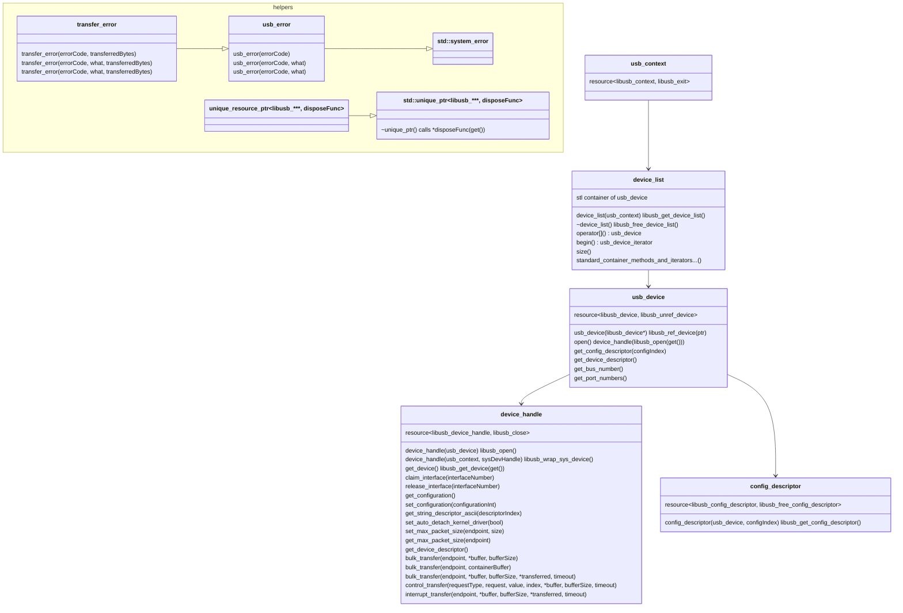

# `dp::libusb` - C++ wrap for libusb-1.0

Copyright 2023 Dale Phurrough  
Licensed under the Apache License, Version 2.0 http://www.apache.org/licenses/LICENSE-2.0

## Overview

`dp::libusb` wraps the C apis of [libusb](https://libusb.info/) with C++ unique resource classes
that follow RAII semantics for ownership and automatic disposal of resources. A simple class
`dp::unique_resource_ptr` derives from `std::unique_ptr` with an additional template
parameter for a C-function pointer to dispose the resource. Most `dp::libusb` classes derive
from this base resource type.

`dp::libusb` is currently focused on the needs of XLink; the protocol to communicate with
Intel Movidius/Myriad devices. A `std::shared_ptr` base for resources was considered for
some use cases. It is not implemented due to the limited needs of XLink; a single owner.

Many raw libusb types, e.g. `libusb_device_descriptor`, are used in their simple POD form.
Some libusb resources are not implemented, e.g. asynchronous device I/O.

## Rules

Most behaviors of `dp::libusb` resources derive from `std::unique_ptr`.

1. `dp::libusb` resources permit empty/nullptr contents.
   `dp::libusb::device_handle handle{nullptr};` and `handle.reset()` are both valid code.
2. Behavior is undefined when code uses or operates on an empty resource.
   `handle.claim_interface(1);` and `*handle` would both likely crash your application.
3. Behavior is undefined when code transforms an empty resource.
   `libusb_device* device = nullptr; dp::libusb::device_handle handle{device};` will likely crash your application.
4. `dp::libusb::device_list` follows the behaviors and apis of STL containers. It can
   be used in places an STL container can be used.
5. Raw libusb return codes for failures are transformed into `dp::libusb::usb_error` exceptions
   with error text sourced from `libusb_strerror()`.
6. Raw resource pointers can be retrieved with `get()` to use with libusb C apis.

## Object Model and Types

All libusb wrapper classes are derived from `unique_resource_ptr<libusb_****, disposeFunc>`
where `libusb_****` is the native libusb POD struct and `disposeFunc` is the native libusb disposing function.

`unique_resource_ptr<>` is a helper class that inherits from `std::unique_ptr<libusb_****, unique_resource_deleter<libusb_****, disposeFunc>>`. It uses the normal `std::unique_ptr` custom deleter feature to automatically call `*disposeFunc(unique_ptr::get())`.

* `usb_context` enhances raw `libusb_context*`
* `device_list` stl container generates and grants access to all `usb_device` on the host
* `usb_device` enhances raw `libusb_device*`
* `device_handle` enhances raw `libusb_device_handle*`
* `config_descriptor` enhances raw `libusb_config_descriptor*`
* all remaining libusb classes and structs are used unchanged

The typical process is

1. Create a `usb_context`
2. From that context get a `device_list`
3. From that list choose a `usb_device`
4. From that device get a `device_handle`
5. Operate and transfer on that handle
6. All resource lifetimes are RAII managed including resource release/free/exiting.

### Class diagram

In this diagram, the inheritance `public unique_resource_ptr<libusb_****, disposeFunc>` is abbreviated `resource<libusb_****, libusb_disposeFunction>`.

